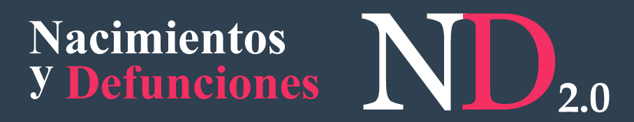

<!DOCTYPE html>
<html lang="es">
<head>
    <meta charset="UTF-8">
    <meta name="viewport" content="width=device-width, initial-scale=1.0">
    <title>Certificado de Defunción</title>
    <link href="https://cdn.jsdelivr.net/npm/bootstrap@5.3.2/dist/css/bootstrap.min.css" rel="stylesheet">
</head>
<body>
    <header class="container-fluid bg-dark text-white">
        

            

                
            

            

                
            

        

    </header>

    <main class="container mt-4">
        <section>
            

                <h2>
                    <b>
                        Certificado de defunción: 24099220048960
                    </b>
                </h2>
                <h3>Tipo de defunción: No fetal</h3>
                <h3>Fallecido: CC1022936358 - YERLI MICHEL PAYARES ARAQUE</h3>
                <h3>Lugar de defunción: GUAJIRA - MAICAO</h3>
                <h3>Institución prestadora de servicio de salud: HOSPITAL - MAICAO - EMPRESA SOCIAL DEL ESTADO UNIDAD DE ATENCIÓN EN SALUD - MAICAO</h3>
                <h3>Estado de registro: Activo</h3>
                <h3>Fecha de registro: 2024-12-27</h3>
                <h3>Fecha de impresión: 2024-12-28 09:14</h3>
                <h3>Fecha de validación: 2024-12-27 19:00</h3>
            

        </section>
    </main>

    <footer class="container-fluid bg-dark text-white text-center mt-4">
        

            

                Atención al usuario: Teléfono en Bogotá D.C. +57(1)330 5043, en el resto del país 018000 960020 
                Horario de lunes a viernes 7am a 6pm, sábados de 8am a 1pm jornada continua - Centro de Contacto al Ciudadano 
                Correo electrónico:
                <a href="mailto:soportend@minsalud.gov.co?subject=Soporte MIPRES" class="text-info text-decoration-underline">
                    soportend@minsalud.gov.co
                </a>
            

            
Versión - 1.0.0.0 
                Copyright © 2024 - Ministerio de Salud y Protección Social
            

        

    </footer>

    
</body>
</html>
